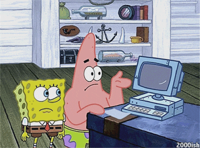

<h1 align="center">👋 Olá, Bem-vindo(a) ao meu GitHub!</h1>

  

---

  

---

## 🚀 Tech Stack

 
  
  
  
  
  
  
  
  
  
  
  
  

---

## 📈 Estatísticas

  
  

  

---

## 📌 Status Atual

- 📚 Estudando: **Java Avançado, JDBC, Estruturas de Dados, Padrões de Projeto**  
- 🔨 Construindo: **Sistema para posto de combustível (Java + MySQL)**  
- 🎯 Objetivo: **Dominar Back-End e me tornar Desenvolvedor Java**  
- 🧰 Ferramentas principais: **IntelliJ IDEA, VS Code, Docker e Linux**

---

## 🙋🏾 Sobre mim

Sou **Davi Heinzen**, estudante de Desenvolvimento de Sistemas na **WEG**.  
Apaixonado por tecnologia, criação de sistemas e descobrir como tudo funciona nos bastidores.

Quando não estou estudando ou programando, estou:

- Jogando no PC 🎮  
- Andando de moto 🏍️  
- Criando e melhorando projetos no GitHub ⚙️  

---

## 📫 Contato

---

  <b>⭐ Se curtir meus projetos, não esquece de deixar uma estrela!</b>

---

